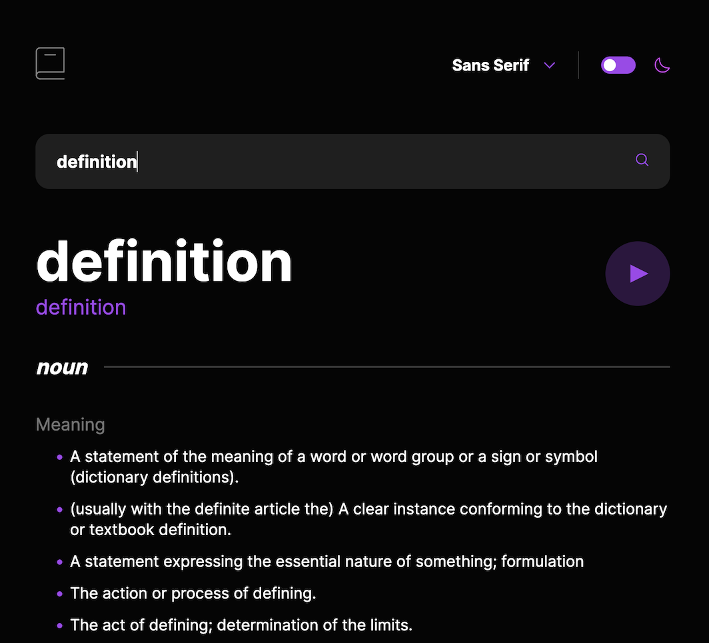

# Dictionary web app

## Table of contents

- [Overview](#overview)
  - [The challenge](#the-challenge)
  - [Screenshot](#screenshot)
  - [Links](#links)
- [My process](#my-process)
  - [Built with](#built-with)
- [Author](#author)

**Note: Delete this note and update the table of contents based on what sections you keep.**

## Overview

### The challenge

Users should be able to:

- Search for words using the input field
- See the Free Dictionary API's response for the searched word
- See a form validation message when trying to submit a blank form
- Play the audio file for a word when it's available
- Switch between serif, sans serif, and monospace fonts
- Switch between light and dark themes
- View the optimal layout for the interface depending on their device's screen size
- See hover and focus states for all interactive elements on the page

### Screenshot

### Links

- Live Site URL: [Dictionary Web App](https://nablanco.github.io/dictionary-web-app/)

## My process

### Built with

- Semantic HTML5 markup
- Flexbox
- Mobile-first workflow
- [React](https://reactjs.org/) - JS library
- [Styled Components](https://styled-components.com/) - For styles

## Author

- Website - [Nicholas Blanco](https://www.nicholasblanco.com/)
